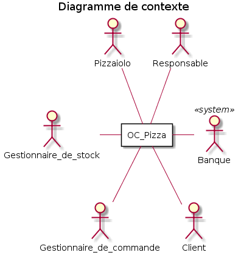
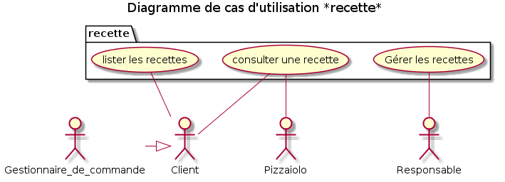
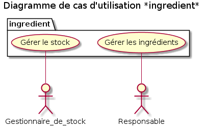
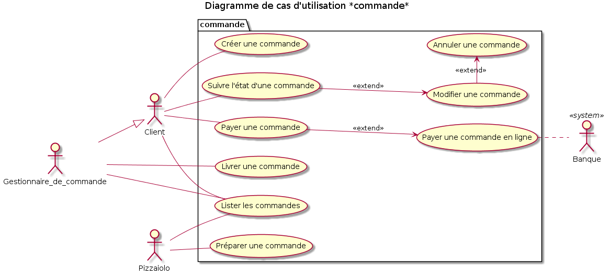
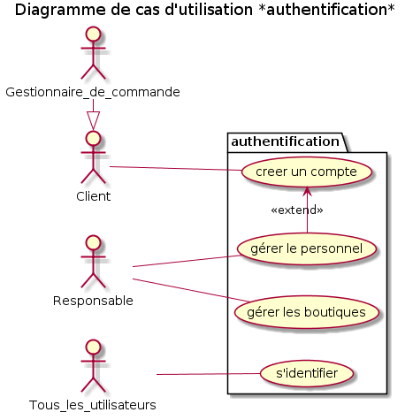
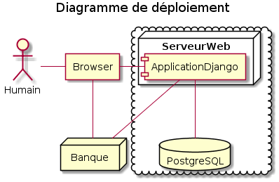
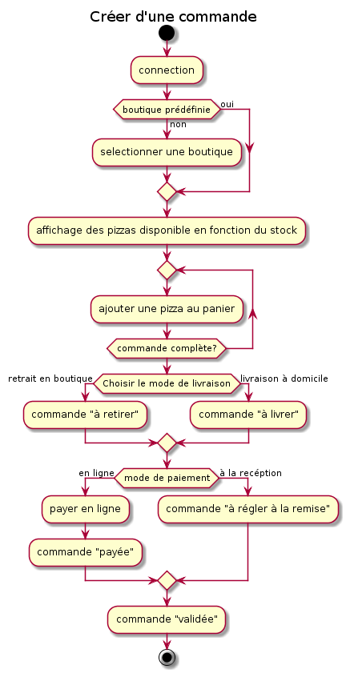

*Document disponible à cette adresse pour consulter les liens: https://github.com/Zepmanbc/oc_dapython_pr4/blob/master/doc/analyse.md*

# Analysez le besoin pour votre client pour son groupe de pizzerias

## Contexte

« OC Pizza » est un jeune groupe de pizzeria en plein essor et spécialisé dans les pizzas livrées ou à emporter. Il compte déjà 5 points de vente et prévoit d’en ouvrir au moins 3 de plus d’ici la fin de l’année. Un des responsables du groupe a pris contact avec vous afin de mettre en place un système informatique, déployé dans toutes ses pizzerias et qui lui permettrait notamment :

* d’être plus efficace dans la gestion des commandes, de leur réception à leur livraison en passant par leur préparation ;
* de suivre en temps réel les commandes passées et en préparation ;
* de suivre en temps réel le stock d’ingrédients restants pour savoir quelles pizzas sont encore réalisables ;
* de proposer un site Internet pour que les clients puissent :
    * passer leurs commandes, en plus de la prise de commande par téléphone ou sur place,
    * payer en ligne leur commande s’ils le souhaitent – sinon, ils paieront directement à la livraison
    * modifier ou annuler leur commande tant que celle-ci n’a pas été préparée
* de proposer un aide mémoire aux pizzaiolos indiquant la recette de chaque pizza

## 1 - Règles fonctionnelles

Le *Responsable* gère les comptes du personnel (création, modification).
Chaque employé a un profil et est rattaché à une boutique.

*Gestionnaire de commande*: il est le relais du client pour prendre les commandes par téléphone ou en boutique. Il gère également la gestion des livraisons et le paiement des commandes en boutique.

*Gestionnaire de stock*: il s'occupe de mettre à jour le stock d'ingrédients à la réception et après inventaire. Le stock est géré indépendamment pour chaque boutique.

*Pizzaiolo*: il réalise les commandes suivant l'ordre d'arrivé dans le système et les met à disposition.

Le *Client* peut commander de 3 manières différentes:
* en boutique
* par téléphone
* en ligne

Le *Client* peut être livré ou récupérer sa commande en boutique.

Le *Gestionnaire de commande* peut sélectionner un client existant ou en créer un pour créer une commande. Le Client peut être créé/identifié par son numéro de téléphone. Un client fictif identifié au numéro de la boutique permettra d'enregistrer les commandes prise directement au comptoir si le client ne souhaite pas donner de numéro de téléphone.

Le *Client* peut payer à la remise de la commande ou en ligne dans le cas d'une commande en ligne.

Une commande payée ne peut pas être modifiée ou annulée.

Une commande peut avoir plusieurs statut:
* validée
* en préparation
* prête
* en livraison
* livrée
* annulée
* payée
* terminée ( = livrée + payée)

Une commande est composée de plusieurs produits, chaque produit aura un statut qui déterminera le statut de la commande:
* En attente
* En préparation
* prêt

Une commande est prête lorsque tous les produits sont prêt (pizzas disponible, bouteille/dessert/etc... rassemblé par le Gestionnaire de commande)

## 2 - Les acteurs du système

## 3 - Décomposition du système

Le système se décomposera en 4 parties:

* Les *Commandes*: la gestion des commandes et de leurs évolutions en temps réel.

* Les *Recettes*: La liste des pizzas, leur composition et des produits qu'il est possible de commander.

* Les *Ingrédients*: La gestion du stock et des ingrédients composant les pizzas.

* L'*Authentification*: La gestion du personnel, des boutiques et des clients

## 4 - Les cas d'utilisation

* R01 - Lister les recettes
* R02 - Consulter les recettes
* R03 - Gérer les recettes

* I01 - Gérer le stock
* I02 - Gérer les ingrédients

* C01 - Préparer une commande
* C02 - Créer une commande
* C03 - Suivre l'état d'une commande
* C04 - Modifier une commande
* C05 - Annuler une commande
* C06 - Payer une commande
* C07 - Payer une commande en ligne
* C08 - Livrer une commande
* C09 - Lister les commandes

* A01 - Créer un compte
* A02 - Gérer le personnel
* A03 - Gérer les boutiques
* A04 - S'identifier

## 5 - Cycle de vie d'une commande

* Cycle de vie d'une commande en ligne
* Cycle de vie d'une commande par téléphone et retrait en boutique
* Diagramme Créer une commande
* Diagramme Modifier une commande

## 6 - Solution technique

Une solution en ligne qui permet d'avoir une interface commune entre les clients et le personnel. Cette solution permet de s'affranchir d'un matériel particulier car accessible par un navigateur WEB.

* Amazon Web Service : Hébergeur qui s'adapte au trafic et permet de s'affranchir des problèmes matériel, la garantie de toujours avoir le service en ligne.
* Django : La partie Admin intégrée à Django va permettre d'avoir une gestion des commandes efficace et permet une modularité de l'application afin de prévoir de futures évolutions.
* Nginx/Gunicorn/Postgres : Une combinaison robuste qui permettra à l'application de supporter la croissance de la société.
* HTML5/CSS3/JQuery/Bootstrap : Des technologies WEB qui permettent d'avoir une application répondant aux standards graphique actuels et de s'adapter à l'utilisation mobile.

--- 
---

# R01 : Lister les recettes (package "recette")

|Identification | |
|-|-|
|Acteur(s) | Client (Gestionnaire de recettes) |
|Description | Permettre de consulter toutes les recettes |
|Auteur | Benjamin C. |
|Date(s) | 23/01/2019 (première rédaction) |
|Pré-conditions | une boutique est sélectionnée |
|Démarrage | l'utilisateur demande à voir la liste des recettes |

# COMPLEMENTS

## Ergonomie 

Affichage de toutes les recettes disponible.

## Problèmes résolus 

Faut il proposer plusieurs affichages? (grille, liste)

Définir le ratio information/lisibilité.

Définir l'interaction  possible au niveau de la liste.

Faut-il afficher les recettes qui ne sont pas commandable?

--- 
---

# R02 : Consulter les recettes (package "recette")

|Identification | |
|-|-|
|Acteur(s) | Client, Pizzaiolo |
|Description | permettre de consulter les informations relatifs à une recette suivant son profil |
|Auteur | Benjamin C. |
|Date(s) | 19/01/2019 (première rédaction) |
|Pré-conditions | les éléments  constituant les informations de la recettes ont bien été renseigné par le Responsable|
|Démarrage | l'utilisateur sélectionne le détail d'une recette dans la liste des recettes |

# DESCRIPTION

## Le scénario nominal
||Utilisateur|Système|
|-|-|-|
|1| est un client |  |
|2|  | le système affiche la description commerciale et la liste des ingrédients sans quantité |

## Les scénarios d’exception

||Utilisateur|Système|
|-|-|-|
|1.a| est un pizzaiolo | description |
| | description | affiche la description technique |

 

|Fin||
|-|-|
|Scénario nominal | Les informations demandées sont affichées |
|Scénario d’exception | Les informations demandées sont affichées |

 

|Post-conditions||
|-|-
|Scénario nominal | RAS |
|Scénario d’exception | RAS|

# COMPLEMENTS

## Ergonomie 

Afficher les informations dans un popup pour ne pas devoir recharger la page précédente.

## Problèmes résolus 

Définir le niveau de détail de chaque vue (Client/Pizzaiolo).

--- 
---

# R03 : Gérer les recettes (package "recette")

|Identification | |
|-|-|
|Acteur(s) | Responsable |
|Description | Permettre la gestion des recettes |
|Auteur | Benjamin C. |
|Date(s) | 19/01/2019 (première rédaction) |
|Pré-conditions | l'utilisateur doit être identifié en tant que Responsable, les ingrédients doivent exister dans la base |
|Démarrage | l'utilisateur va dans la partie gestion des recettes |

# COMPLEMENTS

## Ergonomie 

Interface standard de gestion de recettes pour faire du CRUD

## Problèmes résolus 

Définir les éléments caractérisant une recette.
* nom
* désignation client
* désignation pizzaiolo
* photo
* liste d'ingrédients (avec quantité)
* prix

--- 
---

# I01 : Gérer le stock (package "ingredient")

|Identification | |
|-|-|
|Acteur(s) | Gestionnaire de stock |
|Description | Permettre de gérer la quantité de stock lors de la livraison des ingrédients et des inventaires |
|Auteur | Benjamin C. |
|Date(s) | 19/01/2019 (première rédaction) |
|Pré-conditions | tous les ingrédients doivent avoir été créé par le responsable|
|Démarrage | Le Gestionnaire de stock va dans la partie de gestion du stock |

# COMPLEMENTS

## Ergonomie 

Interface standard de gestion de stock pour faire du CRUD.

## Problèmes résolus 

Proposer de sélectionner des ingrédients en scannant les codes-barres avec le téléphone.

--- 
---

# I02 : Gérer les ingrédients (package "ingredient")

|Identification | |
|-|-|
|Acteur(s) | Responsable |
|Description | Permettre de gérer la liste des ingrédients |
|Auteur | Benjamin C. |
|Date(s) | 19/01/2019 (première rédaction) |
|Pré-conditions | l'utilisateur est connecté en tant que Responsable |
|Démarrage | l'utilisateur se rend sur la page d'administration des ingrédients|

# COMPLEMENTS

## Ergonomie 

Interface standard de CRUD pour gérer une liste d'ingrédients.

## Problèmes résolus 

Permettre de créer un ingrédient avec le téléphone pour enregistrer un code barre et mettre une photo?

--- 
---

# C01 : Préparer une commande (package "commande")

|Identification | |
|-|-|
|Acteur(s) | Pizzaiolo |
|Description | Permettre la prise en compte de la commande jusqu'à sa mise à disposition |
|Auteur | Benjamin C. |
|Date(s) | 19/01/2019 (première rédaction) |
|Pré-conditions | Une commande est au statut "Validé", le pizzaiolo est connecté |
|Démarrage | Le pizzaiolo se rend sur la liste des commandes |

# DESCRIPTION

## Le scénario nominal
||Utilisateur|Système|
|-|-|-|
|1|  | affiche la liste des commandes |
|2| sélectionne  une commande |  |
|3|  | affiche le détail de la commande |
|4| appuie sur "préparer"  |  |
|5| description | change le statut de la commande à "en préparation" |
|6| réalise les produits qui composent la commande | description |
|7| appuie sur "disponible |  |
|8|  | change le statut de la commande à "prêt" |

## Les scénarios d’exception

||Utilisateur|Système|
|-|-|-|
|6.a| les ingrédients ne sont pas disponible | |
| | contacte le gestionnaire de commande pour trouver une solution (annulation de commande ou approvisionnement d'ingrédients) | |

 

|Fin||
|-|-|
|Scénario nominal | 8 les pizzas sont prêtes|
|Scénario d’exception | 6.a la commande est prise en charge par le gestionnaire de commandes et peut voir son statut modifié par celui-ci => cas d'utilisation Modifier commande |

 

|Post-conditions||
|-|-
|Scénario nominal | toutes les pizzas de la commande sont au statut "prêt" |
|Scénario d’exception | la commande retourne en validée en attendant les ingrédients, est modifiée en retirant des ingrédients ou est annulée |

# COMPLEMENTS

## Ergonomie 

l'interface doit être tactile pour que le pizzaiolo puisse facilement passer de la préparation des pizzas à la gestion de ses commandes.

## Problèmes résolus 

Ajouter une interface vocale?

--- 
---

# C02 : Créer une commande (package "commande")

|Identification | |
|-|-|
|Acteur(s) | Client (Gestionnaire de commande) |
|Description | l'utilisateur doit pouvoir commander des produits |
|Auteur | Benjamin C. |
|Date(s) | 22/01/2019 (première rédaction) |
|Pré-conditions | l'utilisateur doit être identifié sur le système |
|Démarrage | L'utilisateur clique sur le bouton créer une commande |

# DESCRIPTION

## Le scénario nominal
||Utilisateur|Système|
|-|-|-|
|1|  | affiche la liste des pizza disponible dans la boutique |
|2| sélectionne une pizza et l'ajoute au panier |  |
|3| | enregistre en mémoire la liste de commande |
|4| valide le panier |  |
|5| | demande le mode de livraison |
|6| sélectionne une livraison à domicile |  |
|7| | demande le type de paiement |
|8| Sélectionne le paiement en ligne |  |
|9| | appel le cas d'utilisation "Payer une commande en ligne" |
|10| | enregistre la commande dans la base de donnée |
|11| | Confirme la prise en compte de la commande |
|12| | Met à jour le stock suivant les ingrédients qui seront utilisés |
|13| | indique un temps estimatif de livraison |

## Les scénarios d’exception

||Utilisateur|Système|
|-|-|-|
|1.a| souhaite commander dans une autre boutique |  |
||  | affiche la liste des boutiques |
|| sélectionne une boutique |  |
||  | retour en 1 |
|1.b|ne souhaite plus commander||
|4.a| souhaite ajouter une autre pizza, retour à 2 | |
|4.b|ne souhaite plus commander||
|6.a| Sélectionne  le retrait en boutique | |
|6.b|ne souhaite plus commander||
|8.a| Sélectionne  le paiement à la réception |  |
||  | va directement en 10 |
|8.b|ne souhaite plus commander||
|9.a||le paiement en ligne est refusé retour à 8|

 

|Fin||
|-|-|
|Scénario nominal | 13 la commande est passée|
|Scénario d’exception | 1.b, 4.b, 6.b, 8.b la commande est annulée |

 

|Post-conditions||
|-|-
|Scénario nominal | la commande est enregistrée dans la base de donnée, le stock a été mis à jour en conséquence |
|Scénario d’exception | les éventuels éléments sont toujours dans le panier mais il n'y a aucune trace de la commande sur le serveur |

# COMPLEMENTS

## Ergonomie 

Pouvoir ajouter une pizza en un clic sur la liste et avoir un récapitulatif du panier visible sur le même écran.

## Problèmes résolus 

Faut-il prévoir des modifications de recettes? Si oui, sous quelle forme?

Faut il prévoir d'ajouter des commentaires à l'attention du pizzaiolo?

--- 
---

# C03 : Suivre l'état d'une commande (package "commande")

|Identification | |
|-|-|
|Acteur(s) | Client (Gestionnaire de commande) |
|Description | Permettre à l'utilisateur de voir où en est la commande |
|Auteur | Benjamin C. |
|Date(s) | 22/01/2019 (première rédaction) |
|Pré-conditions | la commande a été validée |
|Démarrage | L'utilisateur a sélectionné la page de détail de la commande |

# DESCRIPTION

## Le scénario nominal
||Utilisateur|Système|
|-|-|-|
|1| | Affiche les informations de la commande |
|2| se délecte des informations | |

## Les scénarios d’exception

||Utilisateur|Système|
|-|-|-|
|1.a| description | il y a un problème serveur et un message d'erreur est affiché |

 

|Fin||
|-|-|
|Scénario nominal | l'état de la commande est affichée en temps réel |
|Scénario d’exception | l'information n'est pas disponible |

 

|Post-conditions||
|-|-
|Scénario nominal | rien n'est modifié dans le système |
|Scénario d’exception | rien n'est modifié dans le système |

# COMPLEMENTS

## Ergonomie 

Prévoir de mettre à jour les données en temps réel avec de l'AJAX.

## Problèmes résolus 

Faut-il afficher les information de chaque élément séparément de la commande?

On peut également imaginer d'avoir un tracker GPS pour voir où est le livreur.

--- 
---

# C04 : Modifier une commande (package "commande")

|Identification | |
|-|-|
|Acteur(s) | Client (Gestionnaire de stock) |
|Description | Permettre de modifier la composition d'une commande |
|Auteur | Benjamin C. |
|Date(s) | 22/01/2019 (première rédaction) |
|Pré-conditions | La commande est validée, son statut n'est pas encore en préparation et le mode de paiement est paiement à réception (il n'y a pas de remboursement sur un paiement en ligne)|
|Démarrage | L'utilisateur a sélectionné la page de détail de la commande |

# DESCRIPTION

## Le scénario nominal
||Utilisateur|Système|
|-|-|-|
|1| description | Affiche les informations de la commande |
|2| clique sur modifier la commande | description |
|3|  | vérifie que le statut est validé |
|4|  | demande la confirmation de modification à l'utilisateur |
|5| l'utilisateur confirme vouloir modifier | |
|6|  | met le statut de la commande à "annulé" |
|7|  | réapprovisionne le stock en fonction de ce qui ne sera plus utilisé |
|8|  | appel le cas d'utilisation "Passer une commande" en chargeant le panier avec la commande précédente |

## Les scénarios d’exception

||Utilisateur|Système|
|-|-|-|
|4.a| description | la commande est passé à "préparation" |
|   |  | informe l'utilisateur que la commande est en cours de préparation et ne peut plus être modifiée |
|5.a| l'utilisateur ne souhaites plus modifier la commande |  |

 

|Fin||
|-|-|
|Scénario nominal | 8 le client recommence une nouvelle commande sur la base de l'ancienne, je stock a été mis à jour|
|Scénario d’exception | 4.a, 5.a la commande reste inchangée |

 

|Post-conditions||
|-|-
|Scénario nominal | l'ancienne commande à le statut annulé |
|Scénario d’exception | la commande n'a pas été modifiés dans le système |

# COMPLEMENTS

## Ergonomie 

Le bouton "Modifier" n'est pas affiché si les conditions initiales ne sont pas respectées.

## Problèmes résolus 

Faut-il avoir un détail à la pizza ou dès qu'une seule pizza de la commande est en préparation cela bloque la totalité?

Faut-il permettre Au gestionnaire de stock de forcer une modification?

--- 
---

# C05 : Annuler une commande (package "commande")

|Identification | |
|-|-|
|Acteur(s) | Client (Gestionnaire de commande) |
|Description | Permettre d'annuler une commande |
|Auteur | Benjamin C. |
|Date(s) | 22/01/2019 (première rédaction) |
|Pré-conditions | La commande est validée, son statut n'est pas encore en préparation et le mode de paiement est paiement à réception (il n'y a pas de remboursement sur un paiement en ligne)|
|Démarrage | L'utilisateur a sélectionné la page de détail de la commande |

# DESCRIPTION

## Le scénario nominal
||Utilisateur|Système|
|-|-|-|
|1| description | Affiche les informations de la commande |
|2| clique sur annuler la commande | description |
|3|  | vérifie que le statut est validé |
|4|  | demande la confirmation d'annulation à l'utilisateur |
|5| l'utilisateur confirme vouloir annuler | |
|6|  | met le statut de la commande à "annulé" |
|7|  | réapprovisionne le stock en fonction de ce qui ne sera plus utilisé |

## Les scénarios d’exception

||Utilisateur|Système|
|-|-|-|
|4.a| description | la commande est passé à "préparation" |
|   |  | informe l'utilisateur que la commande est en cours de préparation et ne peut plus être annulée |
|5.a| l'utilisateur ne souhaites plus annuler la commande |  |

 

|Fin||
|-|-|
|Scénario nominal | 7 la commande est annulée |
|Scénario d’exception | 4.a, 5.a la commande reste inchangée |

 

|Post-conditions||
|-|-
|Scénario nominal | la commande à le statut annulé et le stock mis à jour |
|Scénario d’exception | la commande n'a pas été modifiée dans le système |

# COMPLEMENTS

## Ergonomie 

Le bouton "Annuler" n'est pas affiché si les conditions initiales ne sont pas respectées.

## Problèmes résolus 

Faut il permettre Au gestionnaire de stock de forcer une annulation?

--- 
---

# C06 : Payer une commande (package "commande")

|Identification | |
|-|-|
|Acteur(s) | Gestionnaire de commande |
|Description | description du cas d'utilisation |
|Auteur | Benjamin C. |
|Date(s) | 19/01/2019 (première rédaction) |
|Pré-conditions | une commande est validée au minimum et le client souhaite payer |
|Démarrage | le Gestionnaire de commande reçoit le paiement de la part du Client (par l'intermédiaire du Livreur possible) |

# DESCRIPTION

## Le scénario nominal
||Utilisateur|Système|
|-|-|-|
|1| sélectionne la commande |  |
|2|  | affiche les détails de la commande |
|3| sélectionne l'option payer |  |
|4|  | modifie le statut du paiement à OK |

## Les scénarios d’exception

||Utilisateur|Système|
|-|-|-|
|3.a| | la commande est déjà payée donc l'option payer n'est pas disponible |
|3.b| change d'avis | |

 

|Fin||
|-|-|
|Scénario nominal | 4 la commande à été payée|
|Scénario d’exception | 3.a, 3.b la commande n'a pas été modifiée|

 

|Post-conditions||
|-|-
|Scénario nominal | le statut de paiement de la commande a été modifié|
|Scénario d’exception | le statut de la commande n'est pas modifié|

# COMPLEMENTS

## Ergonomie 

Demander une confirmation avant l'enregistrement pour éviter les fausses manipulations.

## Problèmes résolus 

Faut il prévoir d'enregister le type de paiement? (cash, cheque, CB ?)

--- 
---

# C07 : Payer une commande en ligne (package "commande")

|Identification | |
|-|-|
|Acteur(s) | Client |
|Description | Permettre à l'utilisateur de payer la commande en ligne |
|Auteur | Benjamin C. |
|Date(s) | 22/01/2019 (première rédaction) |
|Pré-conditions | La commande en cours de validation |
|Démarrage | le client vient de confirmer sa commande et est invité à payer |

# DESCRIPTION

## Le scénario nominal
||Utilisateur|Système|
|-|-|-|
|1| | renvoi vers le site de la banque |
|2| renseigne ses coordonnés bancaire puis valide |  |
|3| | la banque valide le paiement |

## Les scénarios d’exception

||Utilisateur|Système|
|-|-|-|
|1.a|  | le site de la banque n'est pas accessible |
||  | retourne un paiement annulé |
|2.a| ne souhaites plus poursuivre la commande |  |
|3.a|  | la banque refuse le paiement |
||  | retourne un paiement annulé |

 

|Fin||
|-|-|
|Scénario nominal | la variable paiement est passé à validé pour poursuivre la démarche d'achat |
|Scénario d’exception | la variable paiement est refusé |

 

|Post-conditions||
|-|-
|Scénario nominal | la commande est payée |
|Scénario d’exception | la commande doit être  payée par un autre moyen|

# COMPLEMENTS

## Ergonomie 

Intégrer l'interface de paiement directement dans le site.

## Problèmes résolus 

Permettre d'autres paiement en ligne type paypal?

--- 
---

# C08 : Livrer une commande (package "commande")

|Identification | |
|-|-|
|Acteur(s) | Gestionnaire de commande |
|Description | Modifier l'état d'une commande pour mettre son statut sur livré |
|Auteur | Benjamin C. |
|Date(s) | 19/01/2019 (première rédaction) |
|Pré-conditions | la commande est prête à être mise à disposition du client (en directe ou par livraison)|
|Démarrage | le gestionnaire de commande se rend sur la page d'information de la commande |

# DESCRIPTION

## Le scénario nominal
||Utilisateur|Système|
|-|-|-|
|1| | affiche les renseignements sur la commande |
|2| | affiche le bouton "Livrer" |
|3| appuie sur le bouton Livrer | |
|4| | imprime un bon de livraison |
|5| | enregistre le statut dans la base de donnée |

## Les scénarios d’exception

||Utilisateur|Système|
|-|-|-|
|2.a| | les pizzas ne sont pas toutes prêtes donc le bouton livrer n'est pas disponible |
|3.a| ne souhaite plus livrer maintenant et change de page | |
|5.a| | problème réseaux, l'enregistrement ne peut pas être effectué |
| | | affiche un message d'erreur à l'utilisateur |

 

|Fin||
|-|-|
|Scénario nominal | la commande est considérée livrée|
|Scénario d’exception | 2.a, 3.a, 5.a le statut de la commande reste inchangé|

 

|Post-conditions||
|-|-
|Scénario nominal | la base de donnée à été mise à jour et un bon de livraison a été imprimé|
|Scénario d’exception | il n'y a pas eu de modification de la base de donnée|

# COMPLEMENTS

## Ergonomie 

Le bouton livraison ne s'affiche uniquement quand toutes les pizzas sont au statut prête.

Le bon de livraison indique:
* le type de livraison (livraison ou retrait en boutique)
* le statut de paiement
* les informations du client

## Problèmes résolus 

Quel est le format préféré? ticket de caisse, bon autocollant à coller sur la boite, feuille A4 standard?

--- 
---

# C09 : Lister les commandes (package "commande")

|Identification | |
|-|-|
|Acteur(s) | Gestionnaire de commande, Pizzaiolo, Client |
|Description | Permettre de lister les commandes |
|Auteur | Benjamin C. |
|Date(s) | 19/01/2019 (première rédaction) |
|Pré-conditions | L'utilisateur est connecté |
|Démarrage | l'utilisateur demande l'affichage des commandes en cours |

# COMPLEMENTS

## Ergonomie 

Permettre à l'utilisateur de filtrer suivant son besoin (date, statut de commande). Il y aura un système de recherche pour trouver une commande plus rapidement.

Le Gestionnaire de commande aura une vision globale de toutes les commandes en cours tant qu'elles ne sont pas terminées.

Le Pizzaiolo aura une vision des commandes à préparer.

Le Client aura une vision sur l'historique de ses commandes.

## Problèmes résolus 

Proposer une interface pour trouver le bon équilibre entre lisibilité et quantité d'informations.

--- 
---

# A01 : Créer un compte (package "authentification")

|Identification | |
|-|-|
|Acteur(s) | tous les usagers |
|Description | permettre de créer un compte utilisateur pour soit même (Client), pour réaliser une commande (Gestionnaire de commandes) ou pour un nouveau collaborateur (Responsable) |
|Auteur | Benjamin C. |
|Date(s) | 21/01/2019 (première rédaction) |
|Pré-conditions | NA |
|Démarrage | l'utilisateur est invité à créer un compte ou a cliqué sur le lien intentionnellement |

# DESCRIPTION

## Le scénario nominal
||Utilisateur|Système|
|-|-|-|
|1| Remplis le formulaire |  |
|2| valide la création |  |
|3|  | Vérifie les données (champs obligatoire, formats des donnés) |
|4|  | Enregistre les informations dans la base de données |
|5|  | Envoi un email ou un SMS pour confirmer la création de compte |

## Les scénarios d’exception

||Utilisateur|Système|
|-|-|-|
|3.a|  | les données ne sont pas valides |
| |  | indique à l'utilisateur les données non conforme retour à 1 |
|4.a|  | problème réseaux, l'enregistrement ne peut pas être effectué |
| | | affiche un message d'erreur à l'utilisateur |

 

|Fin||
|-|-|
|Scénario nominal | recharge la page avec la session active |
|Scénario d’exception | 4.a la création n'est pas possible, l'utilisateur doit recommencer plus tard|

 

|Post-conditions||
|-|-
|Scénario nominal | un nouveau compte utilisateur est créé dans la base de donnnée |
|Scénario d’exception | un message d'erreur est envoyé à l'administrateur afin de pouvoir corriger le problème |

# COMPLEMENTS

## Ergonomie 

Utiliser les champs de connexion standard pour le remplissage automatique.

Les champs obligatoire: numéro de téléphone (possibilité du l'utiliser comme login), mot de passe si c'est un client.

Si c'est le gestionnaire de commande, il peut créer un compte avec uniquement un numéro de téléphone, la personne pourra se créer un compte plus tard et retrouver ses commandes.

Si c'est le responsable qui créé les compte d'un nouvel utilisateur, l'adresse email sera obligatoire.

Les champs possible:
* Login
* mot de passe
* adresse email
* numéro de téléphone
* adresse de livraison
* boutique préférée

## Problèmes résolus 

Proposer une connexion avec un compte Facebook pour le client.

--- 
---

# A02 : Gérer le personnel (package "authentification")

|Identification | |
|-|-|
|Acteur(s) | Responsable |
|Description | Permettre au responsable de gérer le personnel suivant les mouvements => CRUD |
|Auteur | Benjamin C. |
|Date(s) | 21/01/2019 (première rédaction) |
|Pré-conditions | aucune |
|Démarrage | Le Responsable se rend dans la partie administration du personnel |

## Ergonomie 

Le Responsable peut filtrer les employés par boutique, profil.

il peut modifier des profils, cumuler des droits, assigner une personne à une nouvelle boutique, clôturer un compte.

## Problèmes résolus 

Proposer dans l'ordre de distance par rapport à l'endroit où est l'utilisateur avec une géolocalisation.

--- 
---

# A03 : Gérer les boutiques (package "authentification")

|Identification | |
|-|-|
|Acteur(s) | Responsable |
|Description | Permettre au responsable de gérer la liste des boutiques |
|Auteur | Benjamin C. |
|Date(s) | 21/01/2019 (première rédaction) |
|Pré-conditions | aucune |
|Démarrage | Le Responsable se rend dans la partie administration des boutiques |

# DESCRIPTION

## Le scénario nominal
||Utilisateur|Système|
|-|-|-|
|1| Clique sur le bouton ajouter une boutique| |
|2| | affiche le formulaire de création d'une boutique |
|3| renseigne toutes les informations | |
|4| | Vérifie que les données indispensables soient remplies et correctes |
|5| | enregistre dans la base de donnée |

## Les scénarios d’exception

||Utilisateur|Système|
|-|-|-|
|3.a| arrête l'opération en cours |  |
|4.a| | certains champs ne sont pas valides |
| | | informe l'utilisateur des erreurs et retourne en 2|
|5.a| | problème réseaux, l'enregistrement ne peut pas être effectué |
| | | affiche un message d'erreur à l'utilisateur |

 

|Fin||
|-|-|
|Scénario nominal | 5 une nouvelle boutique est créée|
|Scénario d’exception | 3.a, 4.a, 5.a  il n'y a pas de boutique créée|

 

|Post-conditions||
|-|-
|Scénario nominal | une nouvelle boutique est créée ou modifiée |
|Scénario d’exception | rien n'a changé|

# COMPLEMENTS

## Ergonomie 

Afin de prévenir les fausses manipulations, la suppression d'une boutique ne pourra se faire que si aucun membre du personnel ne lui est encore rattaché.

## Problèmes résolus 

Proposer dans l'ordre de distance par rapport à l'endroit où est l'utilisateur avec une géolocalisation.

--- 
---

# A04 : S'identifier (package "authentification")

|Identification | |
|-|-|
|Acteur(s) | tous les usagés |
|Description | Permettre à l'utilisateur de se connecter pour avoir accès aux fonctionnalités qui lui sont dédiées |
|Auteur | Benjamin C. |
|Date(s) | 21/01/2019 (première rédaction) |
|Pré-conditions | L'utilisateur possède déjà un compte |
|Démarrage | L'utilisateur est invité à se connecter afin de poursuivre une action ou à demander l'authentification intentionnellement |

# DESCRIPTION

## Le scénario nominal
||Utilisateur|Système|
|-|-|-|
|1| Renseigne son nom d'utilisateur et son mot de passe |  |
|2| Valide les informations |  |
|3| | vérifie les information dans la base de données |
|4| | Confirme l'identification et renvoie vers la page précédent la page de connexion |

## Les scénarios d’exception

||Utilisateur|Système|
|-|-|-|
|1.a| ne connais plus son nom d'utilisateur ou son mot de passe | |
|| fait une demande de réinitialisation | |
|| renseigne son numéro de téléphone ou son adresse email | |
|| | le système renvoi par le moyen sélectionné un lien pour réinitialiser |
|| se rend sur l'adresse reçu et entre un nouveau mot de passe | |
||  | enregistre le nouveau mot de passe dans la base de donnée |
||  | renvoi vers la page de connexion 1 |
|4.a|  | les informations de connexion sont fausses, retour à 1 |

 

|Fin||
|-|-|
|Scénario nominal | 4, l'utilisateur est connecté|
|Scénario d’exception | 4.a l'utilisateur n'est pas connecté, il doit suivre le scénario 1.a tant qu'il n'arrive pas en 4|

 

|Post-conditions||
|-|-
|Scénario nominal | une session de connexion est active dans le navigateur de l'utilisateur |
|Scénario d’exception | l'utilisateur uniquement aux données ne nécessitant pas de compte|

# COMPLEMENTS

## Ergonomie 

la page de connexion doit pouvoir s'afficher par-dessus la page en cours pour ne pas perdre le fil de la navigation, permettre une connexion par Facebook.

## Problèmes résolus 

Permettre plusieurs types d'identifiants?
* Facebook
* numéro de téléphone
* adresse email
* login

--- 
---

--- 
---

--- 
---

---
---

