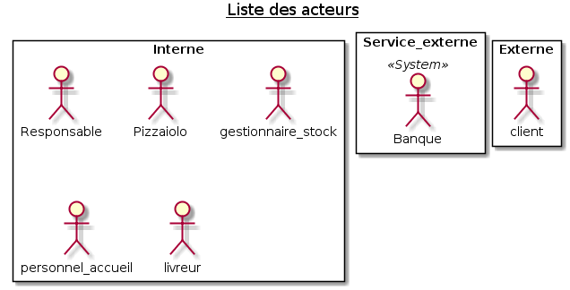
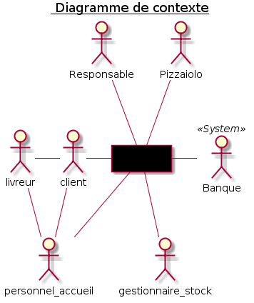
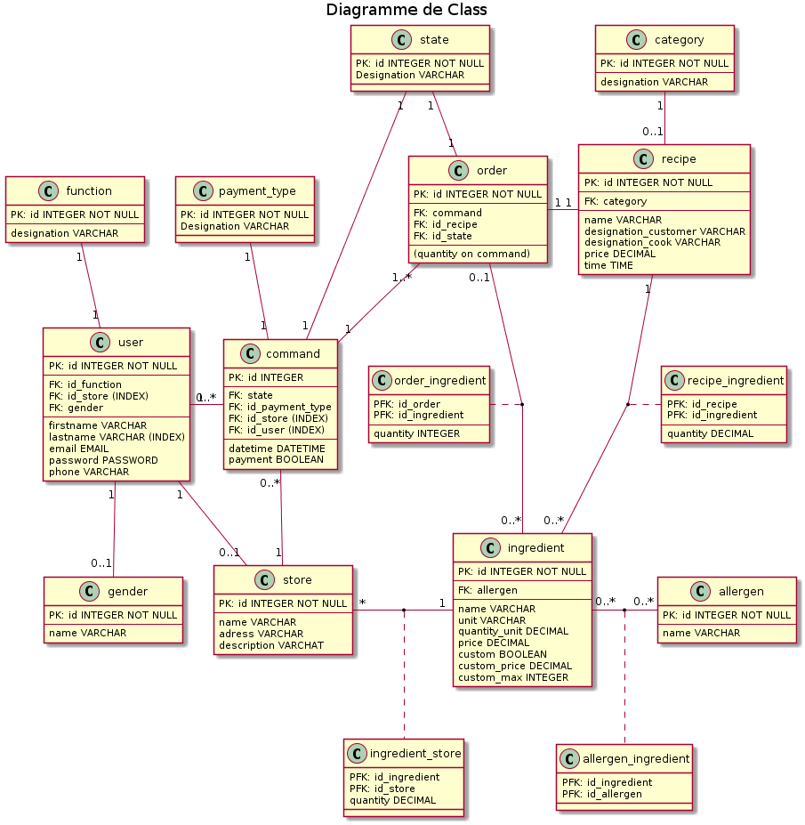

J'ai commencé par lister les différents acteurs dans l'énoncé puis imaginé des scénarios pour voir si il en existe d'autres

# Liste des acteurs

J'ai imaginé le processus de commande d'une pizza d'un client et en ai listé différentes actions

J'ai étoffé cette liste en imaginant les actions de chaque acteur identifié

j'ai pu faire des regroupements dans les actions et je me suis basé sur "CRUD" pour définir toutes les actions

* Commande
* Recette
* Ingrédient

# [Liste des cas d'utilisation](img/0_ListUseCases.png)

# Diagramme de contexte

# Diagrammes de cas d'utilisation pour chaque acteur

* [Agent d'accueil](img/2_Accueil_UseCaseDiagram.png)
* [Responsable](img/2_Responsable_UseCaseDiagram.png)
* [Pizzaiolo](img/2_Pizzaiolo_UseCaseDiagram.png)
* [Gestionnaire de stock](img/2_GestionnaireStock_UseCaseDiagram.png)
* [Client](img/2_Client_UseCaseDiagram.png)
* [Banque](img/2_Banque_UserCaseDiagram.png)

# Diagrammes de packages

* [Commande](img/3_Commande_PackageDiagram.png)
* [Ingrédient](img/3_Ingredient_PackageDiagram.png)
* [Recette](img/3_Recette_PackageDiagram.png)

# Diagrammes d'activité

* [Creation d'une commande (en ligne)](img/4_Commande_CREATE_CMD_ActivityDiagram.png)
* [Création d'une commande (par l'agent d'accueil)](img/4_Commande_CREATE_CMD_2_ActivityDiagram.png)
* [Annulation de commande](img/4_Commande_CANCEL_CMD_ActivityDiagram.png)
* [Préparation de la commande](img/4_preparation_commande.png)
* [Remise de la pizza](img/4_remise_pizza.png)
* [Création d'une recette](img/4_Recette_CREATE_RECIPE_activityDiagram.png)
* [Mettre à jour le stock](img/4_Ingredient_SET_ITEM_ActivityDiagram.png)

# Solution technique

* Django: il y a une partie admin qui ira très bien pour gerer les recettes et les ingrédients, les commandes (en même temps si j'avais dit PHP avec Symphony je me serais tiré une balle dans le pied...)
* Postgresql: parceque c'est classe
* permettre la creation d'un compte et la connection avec facebook, ca permettra d'avoir + facilement des likes et de la pub etc...

# Structure de la database

penser a rajouter :
* la notion de prix de pizza, 
* de prix d'ingrédients, 
* de temps de préparation pour prévoir un temps d'attente, 
* définir le prix de revient de chaque pizza avec la somme d'ingrédients
* on ne peux pas modifier une commande (la liste des pizza) car si ca a été payé c'est le bordel, une commande payé c'est une commande livré. il est possible d'annuler une commande uniquement dans le cas d'une commande a distance non payé.
* quand une commande est lancé le stock d'ingrédients diminu en fonction de la recette
* les différents moyens de paiement en ligne ou en live
* il y a différents comptes utilisateur en fonction du profil avec différents accès
* il est possible de consulter pour commander par téléphone
* il faut aussi penser qu'il y a 5 boutiques et bientot 8 pour savoir où est le stock, les commandes etc...
* **prevoir les demandes pséciales (sans champi, double chorizo, etc...) => ca fait acceder tout le monde à la liste des ingrédrients, prévoir une liste "modifiable"**