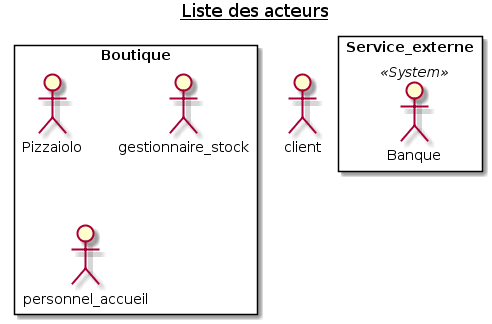
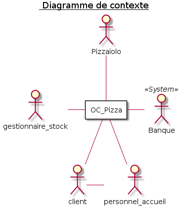
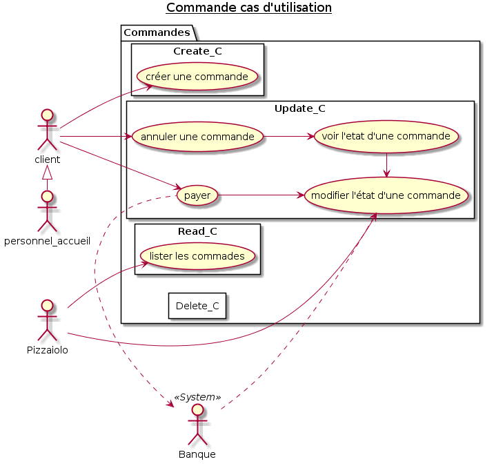
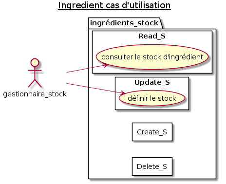
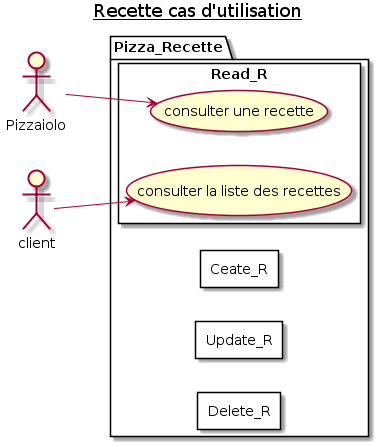
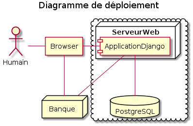

J'ai commencé par lister les différents acteurs dans l'énoncé puis imaginé des scénarios pour voir si il en existe d'autres

# Liste des acteurs

J'ai imaginé le processus de commande d'une pizza d'un client et en ai listé différentes actions

J'ai étoffé cette liste en imaginant les actions de chaque acteur identifié

j'ai pu faire des regroupements dans les actions et je me suis basé sur "CRUD" pour définir toutes les actions

* Commande
* Recette
* Ingrédient

# Diagramme de contexte

# Diagrammes de cas d'utilisation

# Diagrammes d'activité

**voir quels diagrames garder (ou pas) et rajouter des fiches**

* [Creation d'une commande (en ligne)](img/4_Commande_CREATE_CMD_ActivityDiagram.png)
* [Création d'une commande (par l'agent d'accueil)](img/4_Commande_CREATE_CMD_2_ActivityDiagram.png)
* [Personalisation d'une commande](img/4_commande_custom.png)
* [Annulation de commande](img/4_Commande_CANCEL_CMD_ActivityDiagram.png)
* [Préparation de la commande](img/4_preparation_commande.png)
* [Remise de la pizza](img/4_remise_pizza.png)
* [Création d'une recette](img/4_Recette_CREATE_RECIPE_activityDiagram.png)
* [Mettre à jour le stock](img/4_Ingredient_SET_ITEM_ActivityDiagram.png)

# Solution technique

Une solution en ligne qui permet d'avoir une interface commune entre les clients et le personnel. Cette solution permet de s'affranchir d'un matériel particulier car accessible par un navigateur WEB.

* Amazon Web Service : Service qui s'adapte au trafique et permet de s'affranchir des problèmes matériel, la garantie de toujours avoir le service en ligne.
* Django : La partie Admin intégrée à Django va permettre d'avoir une gestion des commandes efficace et permet une modularité de l'application afin de prévoir de futures évolutions.
* Nginx/Gunicorn/Postgres : Une combinaison robuste qui permettra à l'application de supporter la croissance de la société.
* HTML5/CSS3/JQuery/Bootstrap : Des technologies WEB qui permettent d'avoir une application répondant aux standards graphique actuels et de s'adapter à l'utilisation mobile.
* Facebook authentification: Permettre au client de se connecter grace à son compte facebook afin de simplifier l'identification et de se laisser la possibilité d'utiliser les réseaux sociaux pour faire de la publicité.

