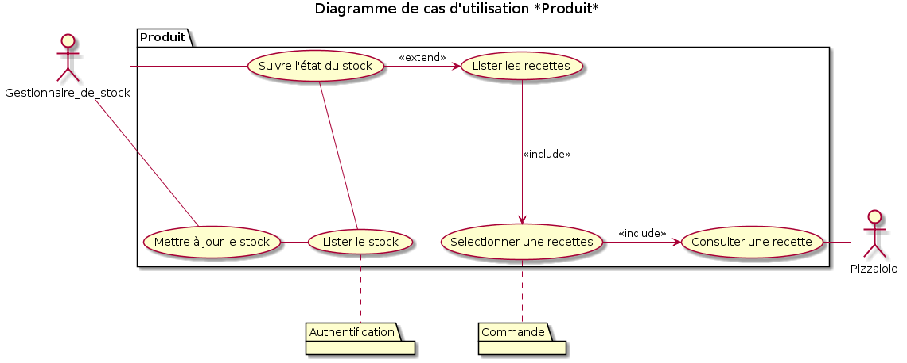
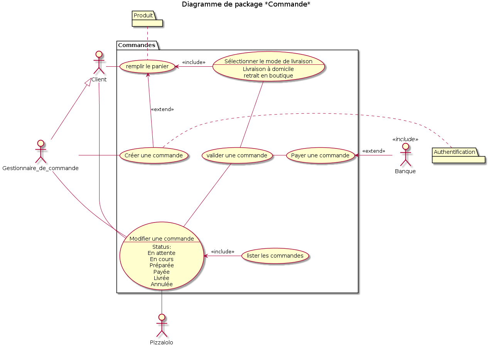
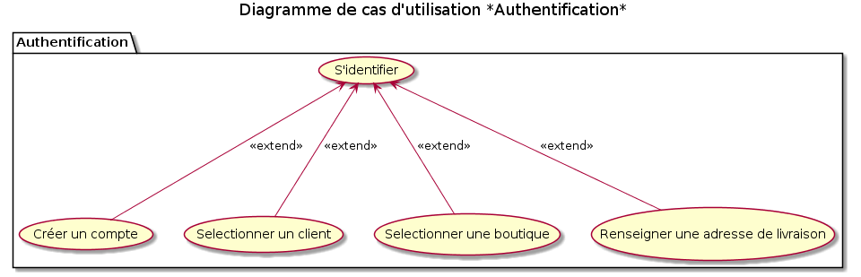
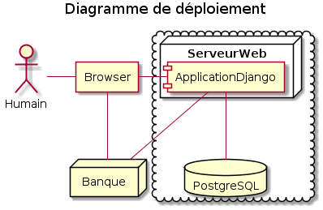

# Analysez le besoin pour votre client pour son goupe de pizzerias

## Contexte

« OC Pizza » est un jeune groupe de pizzeria en plein essor et spécialisé dans les pizzas **livrées** ou à **emporter**. Il compte déjà 5 points de vente et prévoit d’en ouvrir au moins 3 de plus d’ici la fin de l’année. Un des responsables du groupe a pris contact avec vous afin de mettre en place un système informatique, déployé dans toutes ses pizzerias et qui lui permettrait notamment :

* d’être plus efficace dans la gestion des **commandes**, de leur **réception** à leur **livraison** en passant par leur **préparation** ;
* de suivre en temps réel les **commandes passées** et en **préparation** ;
* de suivre en temps réel le **stock d’ingrédients restants** pour savoir quelles pizzas sont **encore réalisables** ;
* de proposer un site Internet pour que les clients puissent :
    * **passer leurs commandes**, en plus de la prise de commande par **téléphone** ou **sur place**,
    * **payer en ligne** leur commande s’ils le souhaitent – sinon, ils paieront directement **à la livraison**
    * **modifier** ou **annuler** leur commande tant que celle-ci n’a **pas été préparée**
* de proposer un aide mémoire aux pizzaiolos indiquant la **recette** de chaque pizza

## 1 - Les acteurs du système

* d’être plus efficace dans la gestion des **commandes**, de leur **réception** à leur **livraison** en passant par leur **préparation** ; **=> Gestionnaire de commandes, Livreur**
* de suivre en temps réel les **commandes passées** et en **préparation** ; **=> Gestionnaire de commande**
* de suivre en temps réel le **stock d’ingrédients restants** pour savoir quelles pizzas sont **encore réalisables** ;** => Gestionnaire de stock**
* de proposer un site Internet pour que les **clients** puissent :
    * **passer leurs commandes**, en plus de la prise de commande par **téléphone** ou **sur place**,** => Gestionnaire de commande**
    * **payer en ligne** leur commande s’ils le souhaitent – sinon, ils paieront directement **à la livraison**** => Banque**
    * **modifier** ou **annuler** leur commande tant que celle-ci n’a **pas été préparée**
* de proposer un aide mémoire aux **pizzaiolos** indiquant la **recette** de chaque pizza

Nous considérons que le livreur n'a pas d'intération directe avec le système, la gestion des commandes faisant appel à ses services sera géré par le Gestionnaire de commandes.

## 2 - Décomposition du système

* d’être plus efficace dans la **gestion des commandes**, de leur **réception** à leur **livraison** en passant par leur **préparation** ;
* de suivre en temps réel les **commandes passées et en préparation** ;
* de suivre en temps réel le **stock d’ingrédients** restants pour savoir quelles pizzas sont encore réalisables ;
* de proposer un site Internet pour que les clients puissent :
    * **passer leurs commandes**, en plus de la prise de commande par **téléphone ou sur place**,
    * **payer en ligne** leur commande s’ils le souhaitent – sinon, ils paieront directement **à la livraison
    * **modifier ou annuler** leur commande tant que celle-ci n’a pas été préparée
* de proposer un aide mémoire aux pizzaiolos indiquant la **recette** de chaque pizza

On distingue 2 grandes familles:
* La gestion du cycle de vie des commandes
* La gestion du produit

Un 3ème package ressort:
* l'authentification: va servir à connaitre le role de chaque utilisateur et également la boutique avec laquelle il intéragit

## 3 - Les cas d'utilisation

## 4 - Fiche Descriptives

## Package Produit
* P01 : Suivre l'état du stock
* P02 : Lister les recettes
* P03 : Mettre à jour le stock
* P04 : Lister le stock
* P05 : Sélectionner une recette
* P06 : Consulter une recette

## Commandes
* C01 : Remplir le Panier
* C02 : Sélectionner le mode de livraison
* C03 : Créer une commande
* C04 : Valider une commande
* C05 : Modifier une commande
* C06 : Lister les commandes
* C07 : Payer une commande

## Authentification
* A01 : S'identifier
* A02 : Créer un compte
* A03 : Sélectionner un Client
* A04 : Sélectionner une boutique
* A05 : Renseigner une adresse de livraison

## 5 - Solution technique

Une solution en ligne qui permet d'avoir une interface commune entre les clients et le personnel. Cette solution permet de s'affranchir d'un matériel particulier car accessible par un navigateur WEB.

* Amazon Web Service : Hébergeur qui s'adapte au trafique et permet de s'affranchir des problèmes matériel, la garantie de toujours avoir le service en ligne.
* Django : La partie Admin intégrée à Django va permettre d'avoir une gestion des commandes efficace et permet une modularité de l'application afin de prévoir de futures évolutions.
* Nginx/Gunicorn/Postgres : Une combinaison robuste qui permettra à l'application de supporter la croissance de la société.
* HTML5/CSS3/JQuery/Bootstrap : Des technologies WEB qui permettent d'avoir une application répondant aux standards graphique actuels et de s'adapter à l'utilisation mobile.
* Facebook authentification: Permettre au client de se connecter grace à son compte facebook afin de simplifier l'identification et de se laisser la possibilité d'utiliser les réseaux sociaux pour faire de la publicité.

