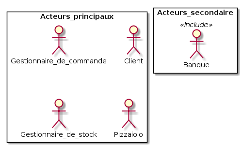
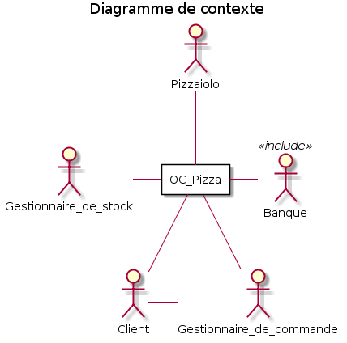
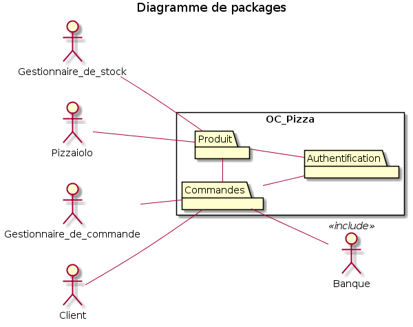

# Analysez le besoin pour votre client pour son goupe de pizzerias

## Contexte

« OC Pizza » est un jeune groupe de pizzeria en plein essor et spécialisé dans les pizzas **livrées** ou à **emporter**. Il compte déjà 5 points de vente et prévoit d’en ouvrir au moins 3 de plus d’ici la fin de l’année. Un des responsables du groupe a pris contact avec vous afin de mettre en place un système informatique, déployé dans toutes ses pizzerias et qui lui permettrait notamment :

* d’être plus efficace dans la gestion des **commandes**, de leur **réception** à leur **livraison** en passant par leur **préparation** ;
* de suivre en temps réel les **commandes passées** et en **préparation** ;
* de suivre en temps réel le **stock d’ingrédients restants** pour savoir quelles pizzas sont **encore réalisables** ;
* de proposer un site Internet pour que les clients puissent :
    * **passer leurs commandes**, en plus de la prise de commande par **téléphone** ou **sur place**,
    * **payer en ligne** leur commande s’ils le souhaitent – sinon, ils paieront directement **à la livraison**
    * **modifier** ou **annuler** leur commande tant que celle-ci n’a **pas été préparée**
* de proposer un aide mémoire aux pizzaiolos indiquant la **recette** de chaque pizza

## 1 - Les acteurs du système

* d’être plus efficace dans la gestion des **commandes**, de leur **réception** à leur **livraison** en passant par leur **préparation** ; => Gestionnaire de commandes, Livreur
* de suivre en temps réel les **commandes passées** et en **préparation** ; => Gestionnaire de commande
* de suivre en temps réel le **stock d’ingrédients restants** pour savoir quelles pizzas sont **encore réalisables** ; => Gestionnaire de stock
* de proposer un site Internet pour que les clients puissent :
    * **passer leurs commandes**, en plus de la prise de commande par **téléphone** ou **sur place**, => Gestionnaire de commande
    * **payer en ligne** leur commande s’ils le souhaitent – sinon, ils paieront directement **à la livraison** => Banque
    * **modifier** ou **annuler** leur commande tant que celle-ci n’a **pas été préparée**
* de proposer un aide mémoire aux pizzaiolos indiquant la **recette** de chaque pizza

Nous considérons que le livreur n'a pas d'intération directe avec le système, la gestion des commandes faisant appel à ses services sera géré par le Gestionnaire de commandes.

## 2 - Décomposition du système

* d’être plus efficace dans la gestion des commandes, de leur réception à leur livraison en passant par leur préparation ;
* de suivre en temps réel les commandes passées et en préparation ;
* de suivre en temps réel le stock d’ingrédients restants pour savoir quelles pizzas sont encore réalisables ;
* de proposer un site Internet pour que les clients puissent :
    * passer leurs commandes, en plus de la prise de commande par téléphone ou sur place,
    * payer en ligne leur commande s’ils le souhaitent – sinon, ils paieront directement à la livraison
    * modifier ou annuler leur commande tant que celle-ci n’a pas été préparée
* de proposer un aide mémoire aux pizzaiolos indiquant la recette de chaque pizza

On distingue 2 grandes familles:
* La gestion du cycle de vie des commandes
* La gestion du produit

Un 3ème package ressort:
* l'authentification: va servir à connaitre le role de chaque utilisateur et également la boutique avec laquelle il intéragit

## 3 - Les cas d'utilisation

