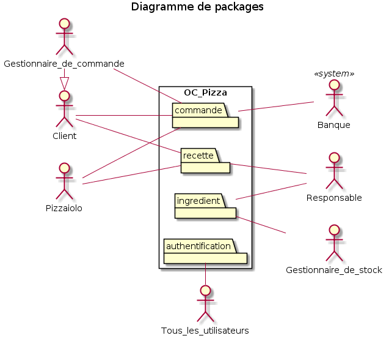
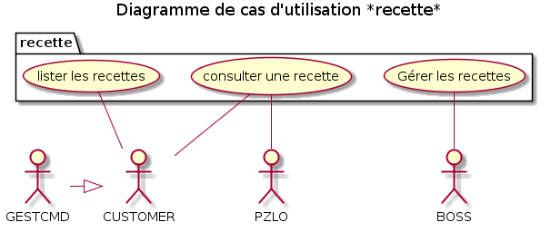
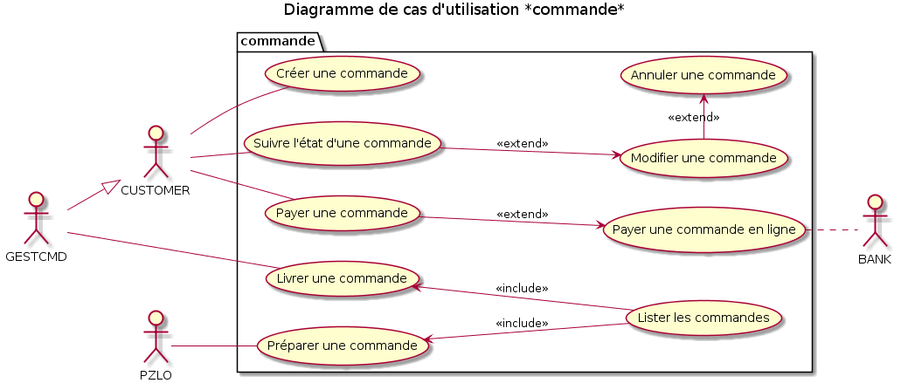
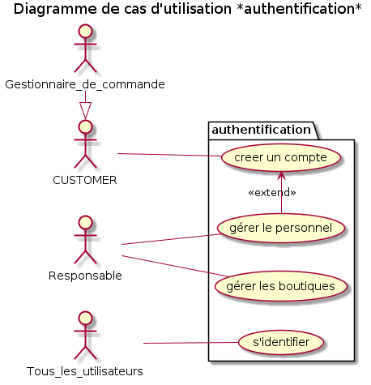

# Analysez le besoin pour votre client pour son goupe de pizzerias

## Contexte

« OC Pizza » est un jeune groupe de pizzeria en plein essor et spécialisé dans les pizzas livrées ou à emporter. Il compte déjà 5 points de vente et prévoit d’en ouvrir au moins 3 de plus d’ici la fin de l’année. Un des responsables du groupe a pris contact avec vous afin de mettre en place un système informatique, déployé dans toutes ses pizzerias et qui lui permettrait notamment :

* d’être plus efficace dans la gestion des commandes, de leur réception à leur livraison en passant par leur préparation ;
* de suivre en temps réel les commandes passées et en préparation ;
* de suivre en temps réel le stock d’ingrédients restants pour savoir quelles pizzas sont encore réalisables ;
* de proposer un site Internet pour que les clients puissent :
    * passer leurs commandes, en plus de la prise de commande par téléphone ou sur place,
    * payer en ligne leur commande s’ils le souhaitent – sinon, ils paieront directement à la livraison
    * modifier ou annuler leur commande tant que celle-ci n’a pas été préparée
* de proposer un aide mémoire aux pizzaiolos indiquant la recette de chaque pizza

## 1 - Règles fonctionnelles

Le *Responsable* gère les comptes du personnel (création, modification).
Chaque employé a un profil et est rattaché à une boutique.

*Gestionnaire de commande*: il est le relais du client pour prendre les commandes par téléphone ou en boutique. Il gère également la gestion des livraisons et le paiement des commandes en boutique.

*Gestionnaire de stock*: il s'occupe de mettre à jour le stock d'ingrédients à la réception et après inventaire. Le stock est géré indépendamment pour chaque boutique.

*Pizzaiolo*: il réalise les commandes suivant l'ordre d'arrivé dans le système et les met à disposition.

Le *Client* peut commander de 3 manières différentes:
* en boutique
* par téléphone
* en ligne

Le *Client* peut être livré ou récupérer sa commande en boutique.

Le *Gestionnaire de commande* peut sélectionner un client existant ou en créer un pour créer une commande. Le Client peut être créé/identifié par son numéro de téléphone. Un client fictif identifié au numéro de la boutique permettra d'enregistrer les commandes prise directement au comptoir si le client ne souhaite pas donner de numéro de téléphone.

Le *Client* peut payer à la remise de la commande ou en ligne dans le cas d'une commande en ligne.

Une commande payée ne peut pas être modifiée ou annulée.

Une commande peut avoir plusieurs statut:
* validée
* en préparation
* prête
* en livraison
* livrée
* annulée
* payée
* terminée ( = livrée + payée)

Une commande est composée de plusieurs produits, chaque produit aura un statut qui déterminera le statut de la commande:
* En attente
* En préparation
* prêt

Une commande est prête lorsque tous les produits sont prêt (pizzas disponible, bouteille/dessert/etc... rassemblé par le Gestionnaire de commande)

## 2 - Les acteurs du système

## 3 - Décomposition du système

Le système se décomposera en 4 parties:

* Les *Commandes*: la gestion des commandes et de leurs évolutions en temps réel.

* Les *Recettes*: La liste des pizzas, leur composition et des produits qu'il est possible de commander.

* Les *Ingrédients*: La gestion du stock et des ingrédients composant les pizzas.

* L'*Autentification*: La gestion du personnel, des boutiques et des clients

## 4 - Les cas d'utilisation

* [R01 - Lister les recettes](fiches/R01.md)
* [R02 - Consulter les recettes](fiches/R02.md)
* [R03 - Gérer les recettes](fiches/R03.md)

* [I01 - Gérer le stock](fiches/I01.md)
* [I02 - Gérer les ingrédients](fiches/I02.md)

* [C01 - Préparer une commande](fiches/C01.md)
* [C02 - Créer une commande](fiches/C02.md)
* [C03 - Suivre l'état d'une commande](fiches/C03.md)
* [C04 - Modifier une commande](fiches/C04.md)
* [C05 - Annuler une commande](fiches/C05.md)
* [C06 - Payer une commande](fiches/C06.md)
* [C07 - Payer une commande en ligne](fiches/C07.md)
* [C08 - Livrer une commande](fiches/C08.md)
* [C09 - Lister les commandes](fiches/C09.md)

* [A01 - Créer un compte](fiches/A01.md)
* [A02 - Gérer le personnel](fiches/A02.md)
* [A03 - Gérer les boutiques](fiches/A03.md)
* [A04 - S'identifier](fiches/A04.md)

## Cycle de vie d'une commande

* [Cycle de vie d'une commande en ligne](img/04_workflow.png)
* [Cycle de vie d'une commande par télephone et retrait en boutique](img/04_workflow2.png)

## 5 - Solution technique

Une solution en ligne qui permet d'avoir une interface commune entre les clients et le personnel. Cette solution permet de s'affranchir d'un matériel particulier car accessible par un navigateur WEB.

* Amazon Web Service : Hébergeur qui s'adapte au trafique et permet de s'affranchir des problèmes matériel, la garantie de toujours avoir le service en ligne.
* Django : La partie Admin intégrée à Django va permettre d'avoir une gestion des commandes efficace et permet une modularité de l'application afin de prévoir de futures évolutions.
* Nginx/Gunicorn/Postgres : Une combinaison robuste qui permettra à l'application de supporter la croissance de la société.
* HTML5/CSS3/JQuery/Bootstrap : Des technologies WEB qui permettent d'avoir une application répondant aux standards graphique actuels et de s'adapter à l'utilisation mobile.

